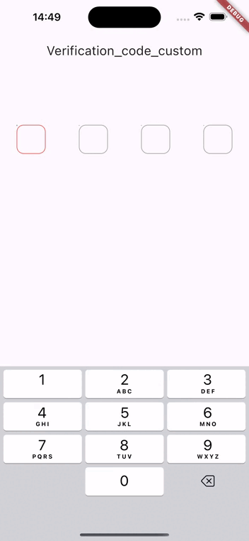

A new flutter custom verification code plug-in

## Getting started

Just easier to used ,you will like it. and give me a start,think you.

```dart
import 'package:verification_code_custom/verification_code_custom.dart';
```

```dart
  Widget verificationCodeWidget(){
  return VerificationCodeCustom(
    textResult: (text) {
      /// do something
    },
  );
}
```




